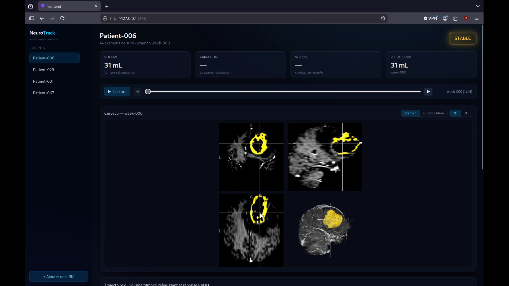
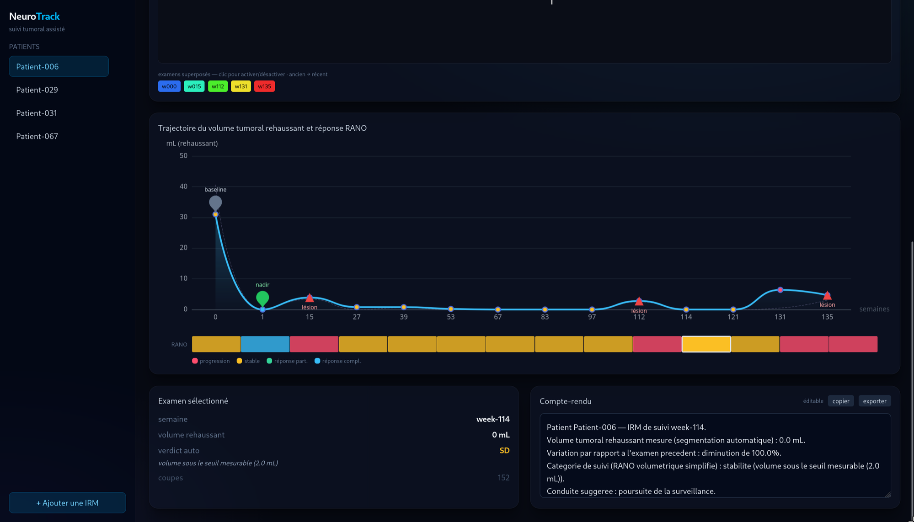
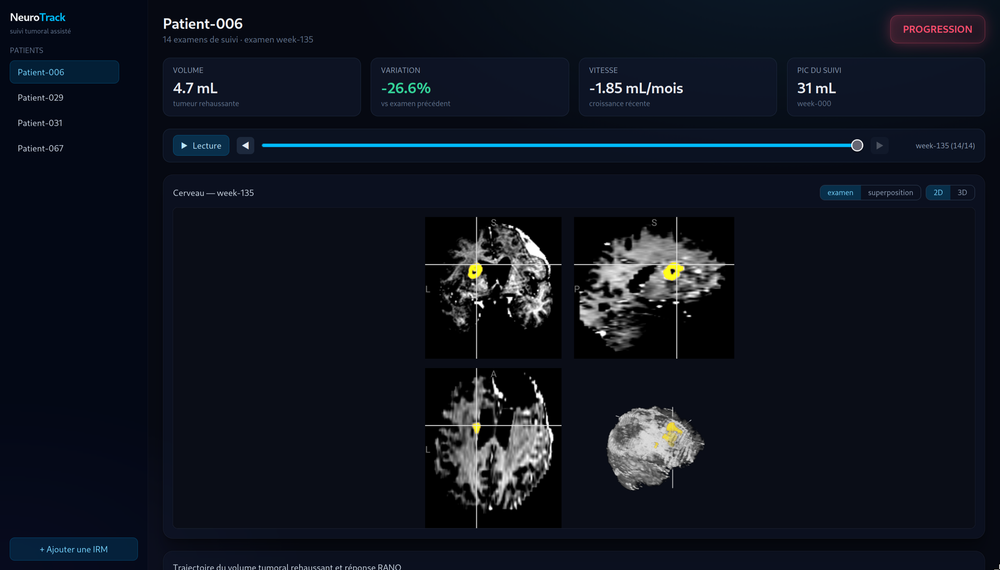
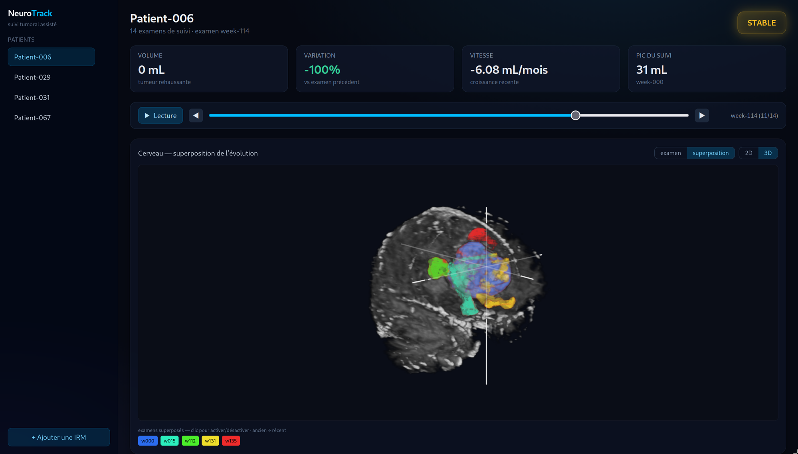

# NeuroTrack

**Suivi tumoral cerebral assiste.** De l'IRM brute a la decision clinique, en passant par la segmentation, la courbe de volume et le verdict de reponse au traitement.

> La segmentation de tumeur cerebrale est un probleme deja resolu. La vraie valeur est ailleurs : mesurer, suivre dans le temps, et en sortir une decision. NeuroTrack fait ce dernier kilometre.

<p align="center">
  <a href="assets/demo.mp4">
    
  </a>
  <br>
  <sub><i>Clic sur l'image pour lancer la demo &middot; fichier : <code>assets/demo.mp4</code></i></sub>
</p>

---

## Ce que ca fait

Un radiologue mesure aujourd'hui la tumeur a la main, en 2D, sur une seule coupe, avec une forte variabilite d'un lecteur a l'autre. NeuroTrack automatise toute la chaine et la rend lisible :

```
IRM (4 sequences)  ->  modele pre-entraine  ->  masque tumoral
   ->  volume rehaussant  ->  comparaison dans le temps  ->  verdict RANO  ->  compte-rendu
```

On ne reentraine jamais la segmentation, on la pulle. Tout le travail est l'aval : la volumetrie, le suivi longitudinal, le recalage, la regle de decision et le rapport.

## Le tableau de bord

<p align="center">
  
</p>

Pour chaque patient, une lecture en un coup d'oeil :

| Element | Ce qu'il montre |
| --- | --- |
| Badge de tete | Le verdict de l'examen courant (STABLE, PROGRESSION, REPONSE...) avec un halo de couleur |
| Volume / Variation / Vitesse / Pic | Volume rehaussant actuel, evolution depuis l'examen precedent, vitesse en mL par mois, plus haut point du suivi |
| Courbe | Trajectoire du volume rehaussant, avec les reperes baseline, nadir et les apparitions de lesion |
| Ruban RANO | Un verdict par examen, colore, cliquable, aligne sous la courbe |
| Examen selectionne | Detail de l'examen pointe : volume, verdict et sa raison lisible, nombre de coupes |
| Compte-rendu | Rapport genere automatiquement, editable, copiable et exportable |

Le curseur et la lecture automatique font defiler la trajectoire ; tout le panneau (KPI, badge, cerveau, rapport) suit l'examen pointe.

## Le cerveau

<table>
<tr>
<td width="50%"></td>
<td width="50%"></td>
</tr>
<tr>
<td align="center"><sub>Examen seul, vue multiplanaire 2D recentree sur la tumeur, plus rendu 3D</sub></td>
<td align="center"><sub>Superposition de l'evolution : un masque par date, du bleu (ancien) au rouge (recent)</sub></td>
</tr>
</table>

Le viewer (NiiVue, WebGL) charge les `.nii.gz` directement dans le navigateur. Deux modes :

- **Examen** : l'IRM d'une date avec son masque par dessus. En 2D la vue se recentre sur le centroide de la tumeur pour qu'on la voie tout de suite, en 3D un rendu volumique.
- **Superposition** : tous les masques recales sur une reference commune, empiles avec un degrade temporel. On choisit les dates a afficher via les pastilles. C'est la lecture qui rend l'evolution evidente.

## Les briques techniques

**Verdict RANO volumetrique.** Une regle deterministe sur le seul volume rehaussant : hausse vs nadir (progression), baisse vs baseline (reponse), passage sous le seuil mesurable (reponse complete), sinon stable. Chaque verdict affiche sa raison ("hausse de 41% sur le nadir"...). Ne lit aucune cotation externe, donc tourne tel quel sur un patient jamais cote.

**Segmentation in-app.** Le modele MONAI `brats_mri_segmentation` tourne dans le backend, charge a la demande. Le bouton "Ajouter une IRM" televerse 4 sequences (T1c, T1, T2, FLAIR), segmente, et l'examen devient un patient suivi. On garde le canal rehaussant, celui que RANO mesure.

**Recalage et detection de nouvelle lesion, in-app.** Les examens d'un meme patient ne sont pas dans le meme espace. Le backend les recale (rigide, SimpleITK) sur la reference la mieux couverte, applique la transfo aux masques, puis cherche par composantes connexes les foyers qui apparaissent la ou il n'y avait rien. Une nouvelle lesion force un verdict de progression, critere RANO independant du volume. Meme resultat pour un patient du cache ou ajoute a la main.

**Compte-rendu.** Texte clinique genere depuis les chiffres : volume, variation, categorie de suivi, conduite suggeree. Editable et exportable.

## Stack

```
Backend    FastAPI (Python)        timeline, verdict RANO, overlay, compte-rendu, segmentation
ML         MONAI BraTS (TorchScript)   segmentation rehaussant, pulle, jamais reentraine
           SimpleITK                   recalage rigide inter-examens
           scipy.ndimage               composantes connexes (nouvelle lesion)
Frontend   React + Vite + TypeScript   tout en TypeScript
           Tailwind                    style
           ECharts                     courbe de volume et ruban RANO
           NiiVue                      cerveau 2D multiplanaire et 3D
Donnees    LUMIERE (public)            gliomes, IRM longitudinales, cotations RANO
Stockage   fichiers (pas de base)      manifest.json par patient + .nii.gz
```

## Lancer (rapide, sans GPU)

Les donnees de demo de plusieurs patients sont incluses, l'app tourne directement.

Prerequis : Python 3.11+ et Node 20+.

```bash
cd neurotrack
python -m venv .venv
.venv/bin/pip install -r requirements.txt

cd frontend && npm install && cd ..

./run.sh
```

`run.sh` lance le backend (FastAPI, port 8077) et le frontend (Vite). Ouvre l'URL affichee par Vite (http://localhost:5173). Ctrl-C arrete les deux.

Dans l'app : choisir un patient, parcourir les examens (curseur ou fleches) ou lancer la lecture automatique, lire le ruban RANO et ses raisons, basculer 2D / 3D, activer la superposition pour voir la tumeur evoluer, relire et exporter le compte-rendu.

## Ajouter une IRM (segmentation in-app)

Le bouton "Ajouter une IRM" televerse 4 sequences (T1c, T1, T2, FLAIR) deja recalees et skull-strippees ; le backend lance le modele a la demande et l'examen devient un patient suivi (manifest + nii, visible dans la liste). Reajouter le meme nom avec une autre semaine ajoute un point a sa timeline.

Cela demande les dependances ML cote backend :

```bash
.venv/bin/pip install -r requirements-ml.txt
```

Sans elles, les patients deja en cache marchent ; `/api/segment` renvoie une erreur. Le modele attend des images pretraitees comme LUMIERE, un DICOM brut non recale ne marchera pas tel quel.

## Structure

```
backend/app.py        API FastAPI (timeline, verdict RANO, overlay, compte-rendu, segmentation) + sert les .nii.gz
backend/seg.py        segmentation par le modele MONAI, chargement paresseux, a la demande
backend/overlay.py    recalage inter-examens + superposition + detection de nouvelle lesion
frontend/             app React (Vite + Tailwind + ECharts + NiiVue)
assets/               captures et video de demo
data/                 donnees de demo LUMIERE : CSV cotations + nii de plusieurs patients
```

## Limites honnetes

- Le verdict RANO ne suit que le volume rehaussant. Il colle sur les progressions franches mais diverge de l'expert au milieu du suivi, la ou RANO s'appuie aussi sur le FLAIR, les nouvelles lesions et la clinique. Decision-support, pas diagnostic.
- On ne distingue pas vraie progression et pseudoprogression (hors scope).
- Le recalage inter-examens est rigide : il suffit pour des examens du meme patient mais ne corrige pas les deformations locales des tissus.
- La segmentation est un modele pre-entraine generaliste, pas valide cliniquement.
